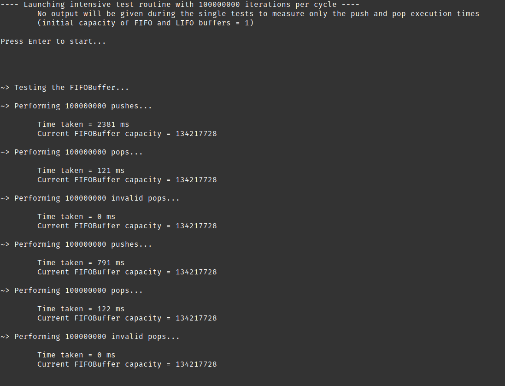
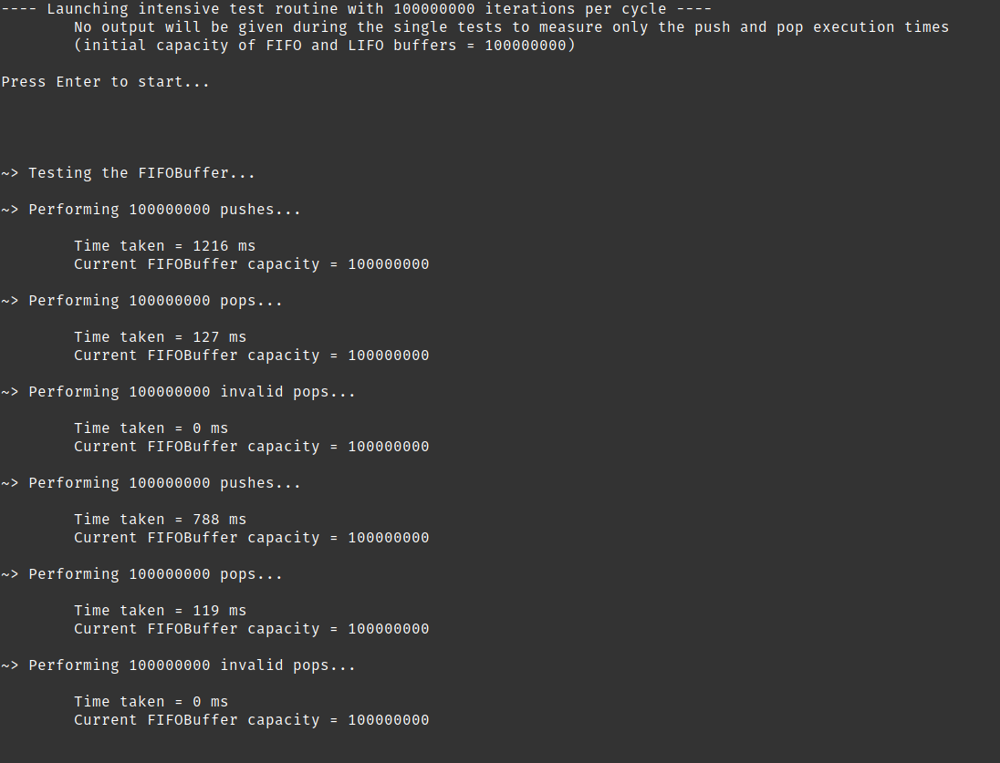

# Dynamic Buffers in C++

C++ data structures that behave like dynamic and generalized buffers used to perform push and pop operations.

The main implementation is the FIFOBuffer class, that behaves like a FIFO queue, but is reallocated (double the capacity each time) if space does not suffice. Useful for applications where the input and output streams are irregular and a fixed size queue could generate errors.

A LIFOBuffer class also exists, that although easier to implement can prove useful in some scenarios.

A demo binary is included to test buffer properties that can be compiled with cmake (or via the provided [cmake.sh](./cmake.sh)):

```sh
mkdir -p build &&
cmake build/ &&
cmake --build ./build --config Release --target all
```

## Screenshots




